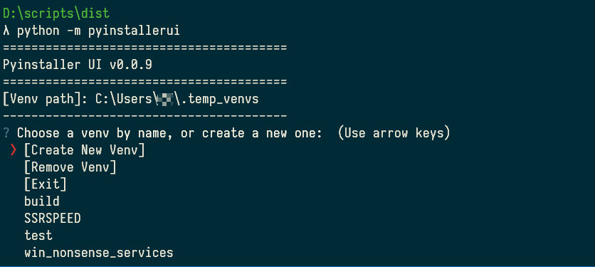
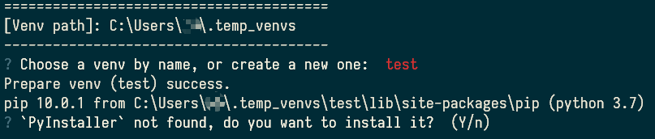
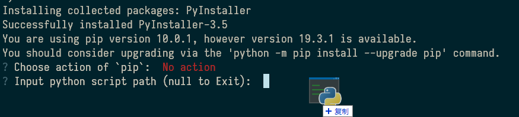
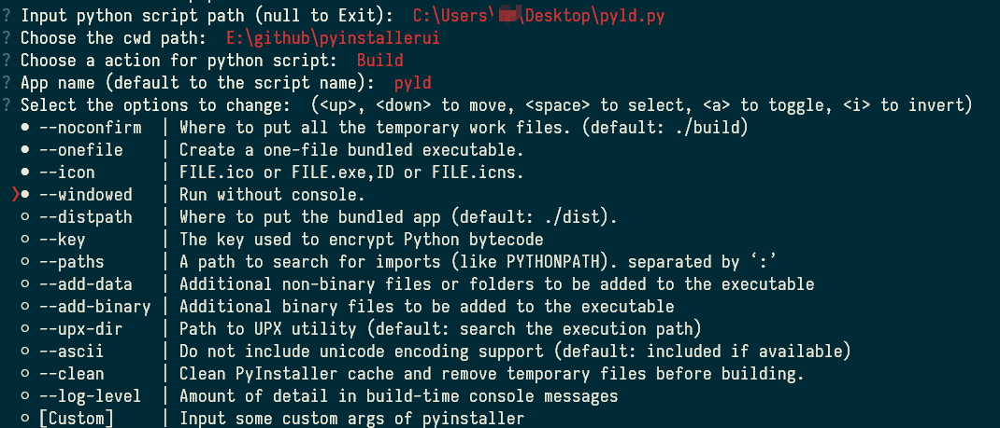

# PyinstallerUI 

Let everyone is able to build python script to exe with pyinstaller, without any doc reading, support python3.7+.

## Features

- [x] Auto manage the venv to reduce the file size which disted by pyinstaller
- [x] Ensure pip installed in the venvs
- [x] Terminal UI for pyinstaller
- [x] Release on the pypi
- [x] Open source from private repository
- [ ] ~~Release `exe` file of this lib~~
- [x] Use `questionary` instead of `PyInquirer`, to use the newer prompt_toolkit.

## Usage

> pip install pyinstallerui -U

1. python -m pyinstallerui
2. drag and drop the files to console, and do as the UI said.
   1. create new venv
   2. install libs with pip
   3. build with pyinstaller
3. no more to learn

## Screenshot

1. Run > python -m pyinstallerui
2. Choose a existing venv, or create a new one

3. Ensure Pyinstaller installed

4. pip install / uninstall some packages, or choose "No action" to skip
5. drag file to the console, or input the file path

5. choose Test for testing
6. choose Build for build into exe
7. fill the app name: pyld
8. choose the checkbox for detail args

9. wait for building
